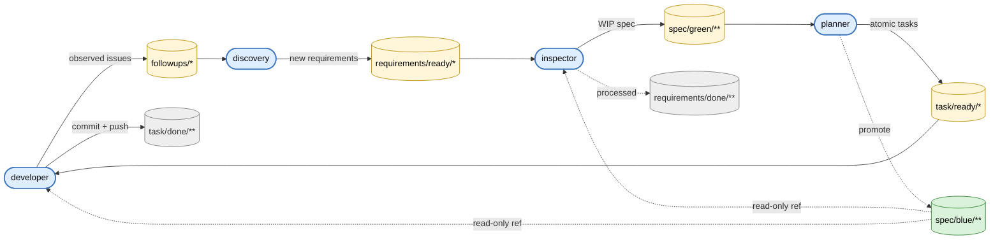

# SDLC Pipeline — Overview

4개 에이전트(**discovery → inspector → planner → developer**)가 각자 독립 세션에서 주기적으로 트리거되어 협업하는 SDD 파이프라인.
상세 책임은 `.claude/agents/*.md`, 공통 규약은 `.claude/rules/*.md` 에 **단일 출처**로 존재한다. 본 문서는 진입점 역할만 한다.

## 파이프라인

에이전트는 **자기 입력 큐만 읽고 자기 출력 큐에만 쓴다**. 루프는 `developer → followups → discovery` 로 닫힌다.

## 규약 인덱스 (Single Source of Truth)

| 규칙 | 주제 |
|------|------|
| [`RULE-01-PIPELINE`](rules/RULE-01-PIPELINE.md) | 파이프라인 흐름, 디렉토리 레이아웃, 쓰기 권한 매트릭스, 이동 원자성 |
| [`RULE-02-AUTONOMY`](rules/RULE-02-AUTONOMY.md) | 독립 실행 원칙(무상태·큐·no-op·비대화·fail-fast·멱등), 공통 금지사항 |
| [`RULE-03-BACKPRESSURE`](rules/RULE-03-BACKPRESSURE.md) | 주기·임계치·pause lock·선결 점검 |
| [`RULE-04-REPORT`](rules/RULE-04-REPORT.md) | stdout 표준 보고 블록 |
| [`RULE-05-MANUAL`](rules/RULE-05-MANUAL.md) | blocked 해제·긴급 롤백·일시 정지 |
| [`RULE-06-TASK-SCOPE`](rules/RULE-06-TASK-SCOPE.md) | Task `## 변경 범위` ↔ `## 검증/DoD` grep 게이트 정합성, `## 스코프 규칙` 섹션 |

> 에이전트 문서와 규약 파일이 충돌하면 **규약 파일이 우선**한다.
> 규약을 바꾸려면 `rules/` 에서만 바꾼다. 에이전트 문서는 참조만.
