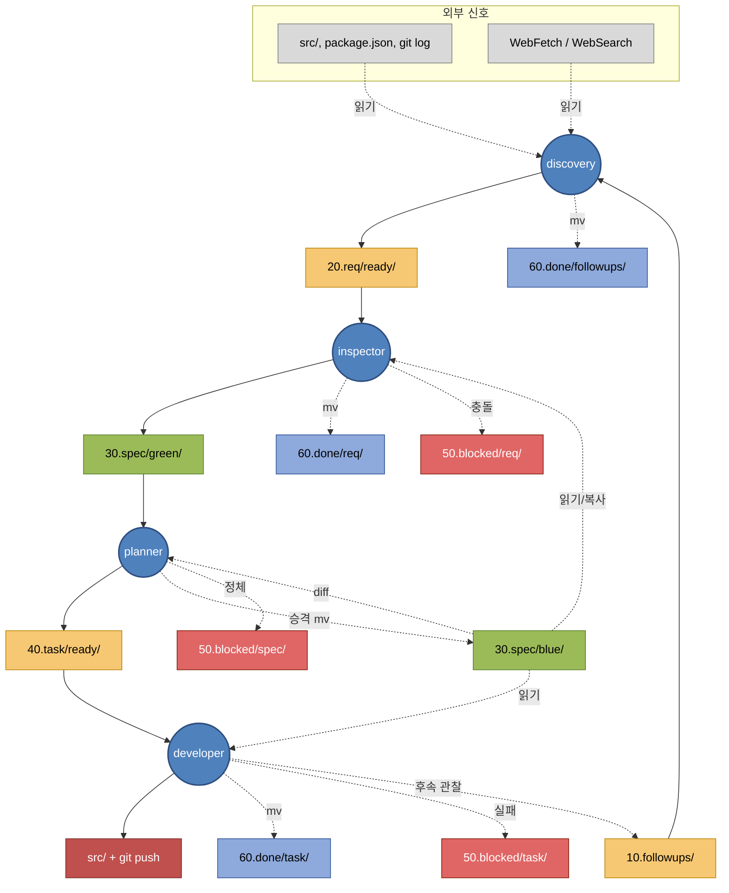

# SDLC Pipeline — 사람을 위한 안내서

이 문서는 `.claude/` 에 정의된 **Spec-Driven Development (SDD) 파이프라인** 을 운영자·리뷰어·신규 합류자가 빠르게 이해하도록 서술형으로 정리한 것이다. 규약의 정확한 문언은 항상 `rules/` 가 우선하며, 이 문서는 그 의도와 그림을 설명한다.

## 한눈에

네 명의 에이전트 (**discovery → inspector → planner → developer**) 가 서로 **대화하지 않고** 각자 독립 세션에서 주기적으로 깨어나, 파일시스템에 놓인 큐만 바라보며 일한다. 사람 팀이 지라·컨플루언스·깃허브를 오가며 하는 일을 **`specs/` 폴더 하나**에서 전부 처리한다고 보면 된다.

요구사항이 떠오르면 `20.req/` 에 들어가고, 명세로 녹아들면 `30.spec/green` 에서 익은 뒤 `30.spec/blue` 로 승격되며, 구체 작업은 `40.task/` 로 쪼개져 최종적으로 **코드 커밋과 푸시** 로 귀결된다. 완료된 산출물은 날짜별로 `60.done/` 에 아카이브되고, 구현 중 발견한 후속 과제는 `10.followups/` 로 되돌아가 다음 사이클의 씨앗이 된다.

## 핵심 원리 — 왜 이렇게 설계했나

1. **무상태 & 큐 기반**: 에이전트는 메모리에 아무것도 남기지 않는다. "다음에 뭘 할지" 는 오직 큐의 파일 목록으로 결정된다. 세션이 중간에 죽어도 상태가 손실되지 않는다.
2. **쓰기 영역 분리**: 각 에이전트는 자기 writer 영역에만 쓸 수 있다 (RULE-01). 서로의 작업을 덮어쓸 물리적 방법이 없다.
3. **Fail-fast & No-op**: 입력이 비었거나 임계치 초과면 조용히 종료. 실패·충돌은 `50.blocked/` 로 격리되며, **에이전트는 blocked 를 자동 재시도하지 않는다** — 수동 개입 지점이 된다.
4. **이동 원자성**: 큐 간 전이는 `mv` 로만. 편집은 이동 **전** 에 끝낸다. 중간 상태가 관찰되지 않는다.
5. **비대화**: 에이전트는 사람에게 질문하지 않는다. 모호하면 격리.

## 4명의 에이전트

| 에이전트 | 역할 | 주기 | 입력 → 출력 |
|---|---|---|---|
| **discovery** | followups + 외부 신호로 요구사항 발굴 | 1~2회/일 | `10.followups/`, 코드/문서 → `20.req/ready/` |
| **inspector** | req 를 spec(green) 에 반영 + drift 동기화 | ~1h | `20.req/ready/`, `30.spec/blue` → `30.spec/green` |
| **planner** | spec diff 를 원자 태스크로 carve + green 승격 | ~1h | `30.spec/green` vs `blue` → `40.task/ready/` |
| **developer** | 태스크 1건 구현·커밋·푸시 | ~15m | `40.task/ready/` → `src/`, `60.done/task/` |

**push 는 developer 만**. 나머지는 로컬 커밋까지다.

## 디렉터리 구조

```
specs/
  10.followups/         developer 가 남기는 후속 관찰 → discovery 가 소비
  20.req/ready/         요구사항 대기열
  30.spec/blue/         승인된 baseline 명세 (planner 만 mv)
  30.spec/green/        작업 중 명세 (inspector 만 편집)
  40.task/ready/        원자 작업지시서 (1건 = 1 PR 크기)
  50.blocked/{req,spec,task}/   격리 + {slug}_reason.md
  60.done/YYYY/MM/DD/   날짜별 아카이브
```

## 전체 플로우



**컬러 범례**

- 🟦 **파랑 (agent)**: 4개의 에이전트 (discovery / inspector / planner / developer)
- 🟧 **주황 (queue)**: 처리 대기 큐 — 에이전트는 `mv` 만, 내용 수정 금지
- 🟩 **연두 (spec)**: 명세 저장소 — `green` 은 WIP, `blue` 는 baseline
- 🟥 **빨강 코드 (code)**: 최종 산출물. developer 가 커밋·푸시하는 유일한 출력
- 🟦 **연파랑 (done)**: 날짜별 아카이브 (`60.done/YYYY/MM/DD/`)
- 🟥 **빨강 (blocked)**: 격리 영역. 에이전트는 재시도하지 않고 사람이 개입
- ⬜ **회색 (external)**: 읽기 전용 외부 신호

## 진행 & 완료 흐름

- **진행**: `req → spec.blue → spec.green → task → code`
- **완료**: `code ok → task done → green promote→blue → req done`
- **피드백 루프**: `developer → followups → discovery` — 구현 중 발견한 범위 밖 이슈가 다음 요구사항의 씨앗이 된다

## 주기와 백프레셔

에이전트는 외부 트리거(cron 등)로 깨어나며, 하류가 밀리면 스스로 멈춘다.

| agent | 주기 | 하류 임계치 |
|---|---|---|
| discovery | 1~2회/일 | `20.req/ready/` 15건 |
| inspector | ~1h | `30.spec/green` 미승격 20건 |
| planner | ~1h | `40.task/ready/` 10건 |
| developer | ~15m | — (최종 단계) |

임계치는 `.claude/pipeline.json` 으로 override 가능 (RULE-05). 전체 또는 특정 에이전트를 멈추려면 `.claude/locks/pipeline.pause` 또는 `.claude/locks/<agent>.pause` 파일만 생성하면 된다.

**inspector 만 예외**: Phase 1 의 drift reconcile (green 의 WIP 마커를 task 완료 기록과 대조해 `[x]` 로 플립) 은 빈 큐·임계치 초과여도 매번 수행한다. green 을 줄이는 방향이라 안전하기 때문.

## 수동 개입이 필요한 순간

에이전트는 실패나 모호함을 만나면 `50.blocked/` 로 격리하고 손을 뗀다. 이때가 사람의 차례다.

1. `specs/50.blocked/{req,spec,task}/{slug}_reason.md` 에서 사유 확인
2. 원인 제거 (의존 task 완료 / spec 보강 / 환경 수정)
3. 원본을 원래 큐(`ready/` 등)로 `mv` 로 되돌리거나 삭제

배포를 되돌려야 하면 **`git revert`** 를 쓴다. `git reset --hard` 는 규약상 금지 (RULE-02). revert 사실은 해당 task 의 `result.md` 하단에 append 한다.

## 커밋 규약 요약

- 메시지: `{scope}({agent}): {요약}` (`scope` ∈ spec/req/task/followup)
- developer 의 구현 커밋만 예외: `{type}: {task title}` (`type` ∈ feat/fix/refactor/chore/test/docs)
- `git add` 는 파일 명시. `git add .` / `-A` 금지 (민감 파일 혼입 방지)
- 훅 실패는 **우회 금지** — 원인을 고치고 새 커밋을 만든다

## 규약 인덱스

| 규칙 | 주제 |
|---|---|
| [RULE-01](rules/RULE-01-PIPELINE.md) | 레이아웃·쓰기 권한·이동 원자성·Task ID |
| [RULE-02](rules/RULE-02-AUTONOMY.md) | 독립 실행 원칙·공통 금지·커밋/푸시 |
| [RULE-03](rules/RULE-03-BACKPRESSURE.md) | 주기·임계치·pause lock·선결 점검 |
| [RULE-04](rules/RULE-04-REPORT.md) | stdout 보고 블록·관용 토큰 |
| [RULE-05](rules/RULE-05-MANUAL.md) | blocked 해제·긴급 롤백·정지·override |
| [RULE-06](rules/RULE-06-TASK-SCOPE.md) | 스코프 규칙 섹션·grep 게이트 정합성 |

에이전트 문서와 rules 가 충돌하면 **rules 가 이긴다**. 규약 변경은 `rules/` 에서만 한다.

## 읽는 순서 추천

- **처음 보는 사람**: 이 README → [CLAUDE.md](CLAUDE.md) → `agents/*.md` 중 관심 있는 에이전트
- **blocked 해제 담당자**: [RULE-05](rules/RULE-05-MANUAL.md) → 해당 `_reason.md`
- **파이프라인 규약을 바꾸려는 사람**: [RULE-01](rules/RULE-01-PIPELINE.md) ~ [RULE-06](rules/RULE-06-TASK-SCOPE.md) 순서대로
